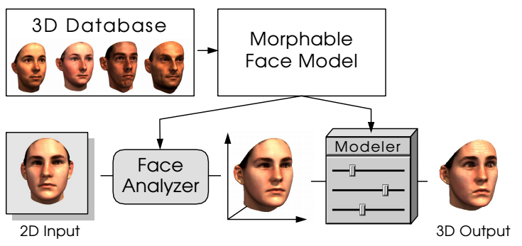

3DMM的初次登场是在1999年的SIGGRAPH上，接下来，人们便把人头的模型称之为"A 3D Morphable Face Model"，其有两个关键的思想：

* **所有的面部都存在点对点的匹配关系，也即许多副人脸的正交基可以加权组合成新的人脸。**

这个建模过程为：
$$
S_{newModel}=\overline  {S}+\sum_{i=1}^m\alpha_iS_i+\sum_{i=1}^n\beta_iE_i
$$
其中$\overline{S}$是形状向量，而$\sum_{i=1}^m\alpha_iS_i$和$\sum_{i=1}^n\beta_iE_i$分别是表情向量和纹理向量的线性叠加，其中$\overline{S}$，$\sum_{i=1}^m\alpha_iS_i$和$\sum_{i=1}^n\beta_iE_i$其实可以看作是在整个大的数据集中使用主成分分析，来得到的前$M$个主成分，而这$M$个主成分，就是我们用于合成的向量。

BFM

1. face的形状和颜色是相分隔开来的，并且与相机的参数等也分隔开。

## 参考资料

> 
>

