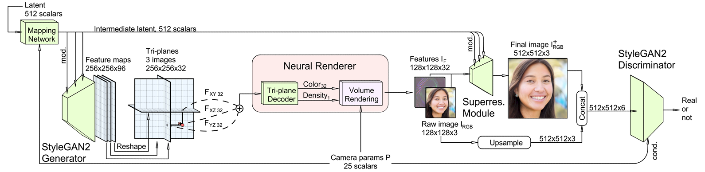

这个故事要从StyleGAN开始讲起。


## EG3D&Triplane


> NeRF(a)的做法是使用带有位置编码的全连接层来表征一个场景，这样**全隐式**带来的问题就是慢。
>
> 体素Voxels(b)的方式就比较直接，但是很难实现高分辨率的渲染。

Tri-plane的范式之所以可以被称之为是hybrid的，其将图片显式的特征沿着三个轴进行正向地特征对齐



> “我们的3D GAN框架由这样几个部分组成：一个位姿条件的基于StyleGAN2的**特征**生成器和映射网络，带有轻量特征解码器的tri-plane 3D表征，一个神经体渲染器，一个超分模块，一个位姿条件的StyleGAN的判别器(**dual discrimination**)”。

所以EG3D自然可以算是[StyleGAN2]([NVlabs/stylegan2: StyleGAN2 - Official TensorFlow Implementation (github.com)](https://github.com/NVlabs/stylegan2))的直接改进,在上面的piplane中，我们NeuralRender本身和其左边的东西都可以算是新的"Generator"，在阅读论文时要与"StyleGAN2中enerator"的概念分隔开。

## SSO Experiment

与GAN要求的泛化性质不同，single-scene over fitting experiment（SSO）是直接从多个输入视图直接提取特征，不需要复杂的特征生成，直白点就是不需要StyleGAN2的生成器来生成tri-prlane的特征，这样使得模型可以专注于对特定场景的学习。       

在GAN设置中，这里的神经渲染器不是生成 RGB 图像，而是汇总32通道三平面中每个通道的特征，并根据给定的相机姿势预测出32通道(32张)特征图像。                                                                                                                                                                                                             

## 效果运行

为了明白我们在做的是什么事情，因此我们先选择进行一边推理的过程，观察下效果

```bash
(eg3d) root@autodl-container-b63c498021-4a56fd7f:~/eg3d/eg3d# python gen_videos.py --outdir=out --trunc=0.7 --seeds=0-3 --grid=2x2 --network datatpoint/ffhq512-128.pkl
/root/miniconda3/envs/eg3d/lib/python3.9/site-packages/scipy/__init__.py:146: UserWarning: A NumPy version >=1.16.5 and <1.23.0 is required for this version of SciPy (detected version 1.24.3
  warnings.warn(f"A NumPy version >={np_minversion} and <{np_maxversion}"
Loading networks from "datatpoint/ffhq512-128.pkl"...
Setting up PyTorch plugin "bias_act_plugin"... Done.
Setting up PyTorch plugin "upfirdn2d_plugin"... Done.
100%|█████████████████████████████████████████████████████████████████████████████████████████| 120/120 [00:41<00:00,  2.87it/s]
```

在推理阶段，在autodl上组的2080ti的卡在一分钟内就完成了生成视频的效果，这里我们选择使用预置的ffhq512-128.pkl权重进行下载，最终得到的效果如下：

<video src="/Users/apple/Downloads/interpolation.mp4"></video>

## StyleGAN系列

StyleGAN解决的是PGGAN特征纠缠的问题，而PGGAN

## 代码结构

EG3D的代码结构比较清晰，但是其中的细节部分对于我这样的入门菜🐔还是相当困难，下面来逐步分解一下代码


## 参考资料

> 
>

