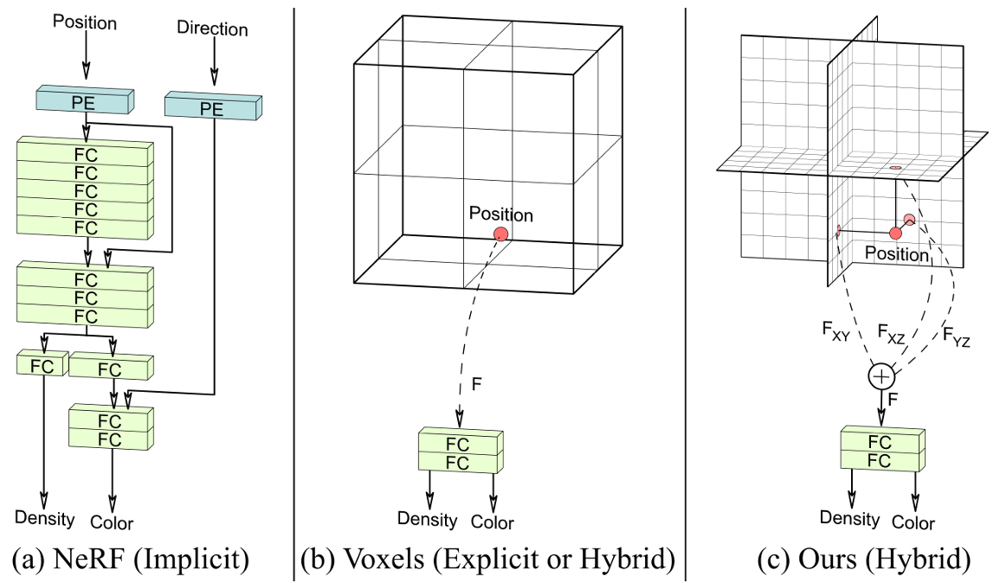

这个故事要从StyleGAN开始讲起。

## StyleGAN系列

StyleGAN解决的是PGGAN特征纠缠的问题，而PGGAN则是解决了GAN在

## EG3D&Triplane



> NeRF(a)的做法是使用带有位置编码的全连接层来表征一个场景，这样**全隐式**带来的问题就是慢。
>
> 体素Voxels(b)的方式就比较直接，但是很难实现高分辨率的渲染。

如图，**Tri-plane已经成为一种新的表示范式**，其之所以可以被称之为是hybrid的，是因为其将图片**显式**的特征归结到三个相互正交的平面上，每个特征平面的size都是$N\times N\times C$,因此，我们可以很方便地将一个三维空间的中的点分别投影到这三个特征平面上，从而得到特征向量$F_{XY},F_{XZ},F_{YZ}$,(双线性插值),然后直接将$\mathbf{F}=F_{XY}+F_{XZ}+F_{YZ}$得到聚合的3D特征向量，然后我们再使用一个小的MLP（**隐式**），直接就把$\mathbf{F}$输出为了颜色和密度.

> “我们的3D GAN框架由这样几个部分组成：一个位姿条件的基于StyleGAN2的**特征**生成器和映射网络，带有轻量特征解码器的tri-plane 3D表征，一个神经体渲染器，一个超分模块，一个位姿条件的StyleGAN的判别器(**dual discrimination**)”。

所以EG3D自然可以算是[StyleGAN2]([NVlabs/stylegan2: StyleGAN2 - Official TensorFlow Implementation (github.com)](https://github.com/NVlabs/stylegan2))的直接改进,在上面的piplane中，我们NeuralRender本身和其左边的东西都可以算是新的"Generator"，在阅读论文时要与StyleGAN2中"Generator"的概念分隔开。

## SSO Experiment

与GAN要求的泛化性质不同，single-scene over fitting experiment（SSO）是直接从多个输入视图直接提取特征，不需要复杂的特征生成，直白点就是不需要StyleGAN2的生成器来生成tri-prlane的特征，这样使得模型可以专注于对特定场景的学习。       

在GAN设置中，这里的神经渲染器不是生成 RGB 图像，而是汇总32通道三平面中每个通道的特征，并根据给定的相机姿势预测出32通道(32张)特征图像。                                                                                                                                                                                                             

## 效果运行

为了明白我们在做的是什么事情，因此我们先选择进行一边推理的过程，观察下效果

```bash
(eg3d) root@autodl-container-b63c498021-4a56fd7f:~/eg3d/eg3d# python gen_videos.py --outdir=out --trunc=0.7 --seeds=0-3 --grid=2x2 --network datatpoint/ffhq512-128.pkl
/root/miniconda3/envs/eg3d/lib/python3.9/site-packages/scipy/__init__.py:146: UserWarning: A NumPy version >=1.16.5 and <1.23.0 is required for this version of SciPy (detected version 1.24.3
  warnings.warn(f"A NumPy version >={np_minversion} and <{np_maxversion}"
Loading networks from "datatpoint/ffhq512-128.pkl"...
Setting up PyTorch plugin "bias_act_plugin"... Done.
Setting up PyTorch plugin "upfirdn2d_plugin"... Done.
100%|█████████████████████████████████████████████████████████████████████████████████████████| 120/120 [00:41<00:00,  2.87it/s]
```

在推理阶段，在autodl上组的2080ti的卡在一分钟内就完成了生成视频的效果，这里我们选择使用预置的ffhq512-128.pkl权重进行下载，最终得到的效果如下：

<video src="/Users/apple/Downloainterpolation.mp4"></video>

## 代码结构

EG3D的代码结构比较清晰，但是其中的细节部分对于我这样的入门菜🐔还是相当困难，下面来逐步分解一下代码：

### Train.py

* **CLICK**

整个代码文件中最引人注目的是`train.py`，而在`train.py`中最抓人眼球的一个是`launch_training`函数,另一个则是由`click`定义的一大堆参数设置：

```python
@click.command()

# Required.
@click.option('--outdir',       help='Where to save the results', metavar='DIR',                required=True)......
# Optional features.
@click.option('--cond',         help='Train conditional model', metavar='BOOL',                 type=bool, default=True, show_default=True)......

# Misc hyperparameters.
@click.option('--p',            help='Probability for --aug=fixed', metavar='FLOAT',            type=click.FloatRange(min=0, max=1), default=0.2, show_default=True)......

# Misc settings.
@click.option('--desc',         help='String to include in result dir name', metavar='STR',     type=str)
@click.option('--metrics',      help='Quality metrics', metavar='[NAME|A,B,C|none]',            type=parse_comma_separated_list, default='fid50k_full', show_default=True)......
# 
@click.option('--sr_module',    help='Superresolution module', metavar='STR',  type=str, required=True)
@click.option('--neural_rendering_resolution_initial', help='Resolution to render at', metavar='INT',  type=click.IntRange(min=1), default=64, required=False)......

```

我们可以观察出，通过`@click.command()`装饰器将下面的函数装饰为命令，而通过`@click.option()`实现对于函数中各种参数的定义，其中的规则如下:

```bash
default: 设置命令行参数的默认值

help: 参数说明

type: 参数类型，可以是 string, int, float 等

prompt: 当在命令行中没有输入相应的参数时，会根据 prompt 提示用户输入

nargs: 指定命令行参数接收的值的个数

metavar：如何在帮助页面表示值
```

相比起argparse，click方式的优势似乎是能针对某个特定的函数来设置参以及配合上`dnnlib.EasyDict()`方法，使得这些函数的传入在层层的子字典嵌套中更为方便和规律一些。

* **LANUCH TRANING函数**

该函数先是设置好输出目录，然后打印一下一些比较重要的参数，是否空运行，以及设置好输出的目录，真正的启动训练则是下面这几句：

```python
    print('Launching processes...')
    torch.multiprocessing.set_start_method('spawn')
    with tempfile.TemporaryDirectory() as temp_dir:
        if c.num_gpus == 1:
            subprocess_fn(rank=0, c=c, temp_dir=temp_dir)
        else:
            torch.multiprocessing.spawn(fn=subprocess_fn, args=(c, temp_dir), nprocs=c.num_gpus)
```

`torch.multiprocessing.set_start_method`是在设置`torch`中内置的几种方法，其中`spawn`是比较常见的一种，随后的`with tempfile.TemporaryDirectory() as temp_dir`为后面的多卡的设置提供了临时的文件目录，不过这里`with ... as ...`的直接读取文件的方式平时可以多用一下，如果是多卡，则是直接通过`spawn`方式直接完成，如果只有单卡，则会转到`subprocess_fn`函数中：	

```python
def subprocess_fn(rank, c, temp_dir):
    dnnlib.util.Logger(file_name=os.path.join(c.run_dir, 'log.txt'), file_mode='a', should_flush=True)

    # Init torch.distributed.
    if c.num_gpus > 1:
        init_file = os.path.abspath(os.path.join(temp_dir, '.torch_distributed_init'))
        if os.name == 'nt':
            init_method = 'file:///' + init_file.replace('\\', '/')
            torch.distributed.init_process_group(backend='gloo', init_method=init_method, rank=rank, world_size=c.num_gpus)
        else:
            init_method = f'file://{init_file}'
            torch.distributed.init_process_group(backend='nccl', init_method=init_method, rank=rank, world_size=c.num_gpus)

    # Init torch_utils.
    sync_device = torch.device('cuda', rank) if c.num_gpus > 1 else None
    training_stats.init_multiprocessing(rank=rank, sync_device=sync_device)
    if rank != 0:
        custom_ops.verbosity = 'none'

    # Execute training loop.
    training_loop.training_loop(rank=rank, **c)
```

首先是`Logger`的设置，在之前的遥感炼丹中，我并没有使用过类似的Logger设置，甚至都是强硬地使用`nohup`来记录试验结果：

```python
class Logger(object):
    """Redirect stderr to stdout, optionally print stdout to a file, and optionally force flushing on both stdout and the file."""

    def __init__(self, file_name: str = None, file_mode: str = "w", should_flush: bool = True):
        self.file = None

        if file_name is not None:
            self.file = open(file_name, file_mode)

        self.should_flush = should_flush
        self.stdout = sys.stdout
        self.stderr = sys.stderr

        sys.stdout = self
        sys.stderr = self

    def __enter__(self) -> "Logger":
        return self

    def __exit__(self, exc_type: Any, exc_value: Any, traceback: Any) -> None:
        self.close()

    def write(self, text: Union[str, bytes]) -> None:
        """Write text to stdout (and a file) and optionally flush."""
        if isinstance(text, bytes):
            text = text.decode()
        if len(text) == 0: # workaround for a bug in VSCode debugger: sys.stdout.write(''); sys.stdout.flush() => crash
            return

        if self.file is not None:
            self.file.write(text)

        self.stdout.write(text)

        if self.should_flush:
            self.flush()

    def flush(self) -> None:
        """Flush written text to both stdout and a file, if open."""
        if self.file is not None:
            self.file.flush()

        self.stdout.flush()

    def close(self) -> None:
        """Flush, close possible files, and remove stdout/stderr mirroring."""
        self.flush()

        # if using multiple loggers, prevent closing in wrong order
        if sys.stdout is self:
            sys.stdout = self.stdout
        if sys.stderr is self:
            sys.stderr = self.stderr

        if self.file is not None:
            self.file.close()
            self.file = None
```

这里的`logger`的功能主要是重定向 `stderr` 到 `stdout`，并可选地将 `stdout` 输出到文件中，同时可以选择是否强制刷新输出流，也即任何的输出都会被保存在类似于`log.txt`这样的文件中，这里更多的细节关系到了输入输出，是我知识的盲区了。

`subprocess_fn`函数后面分别是初始化`Torch`的分布式选项和一些其余的设置，然后才正式进入训练循环：

* **Traning_LOOP.Training_LOOP**

`Training_loop`的方法被写在了`Training_loop.py`的文件中，这个训练函数还是给我带来了很多新鲜的操作：

```python
    start_time = time.time()
    device = torch.device('cuda', rank)
    np.random.seed(random_seed * num_gpus + rank)
    torch.manual_seed(random_seed * num_gpus + rank)
    torch.backends.cudnn.benchmark = cudnn_benchmark    # Improves training speed.
    torch.backends.cuda.matmul.allow_tf32 = False       # Improves numerical accuracy.
    torch.backends.cudnn.allow_tf32 = False             # Improves numerical accuracy.
    torch.backends.cuda.matmul.allow_fp16_reduced_precision_reduction = False  # Improves numerical accuracy.
    conv2d_gradfix.enabled = True                       # Improves training speed. # TODO: ENABLE
    grid_sample_gradfix.enabled = False                  # Avoids errors with the augmentation pipe.
```

例如为了分布式的训练，我们还要在设置`seed`和`device`时候设置`rank`参数；以及可以配置`cudnn.benchmark`来提升做卷积运算时候的速度；`allow_tf32`似乎是是否允许"TF32"格式的矩阵乘法，这个方法可以提高数值计算的精度，但是会降低性能；之后还有一些类似的设置，大部分都是为了优化速度之类的。

下面几行则是`EG3D`独特的构造训练集的方法:

```python
# Load training set.
if rank == 0:
    print('Loading training set...')
training_set = dnnlib.util.construct_class_by_name(**training_set_kwargs) # subclass of training.dataset.Dataset
training_set_sampler = misc.InfiniteSampler(dataset=training_set, rank=rank, num_replicas=num_gpus, seed=random_seed)
training_set_iterator = iter(torch.utils.data.DataLoader(dataset=training_set, sampler=training_set_sampler, batch_size=batch_size//num_gpus, **data_loader_kwargs))
```

首先这里要判断`rank`是否是`0`，是因为在分布式的设置中，通常就`rank`为`0`的进程需要打印日志或者执行一些初始的操作；然后便可以看到再次使用了`dnnlib`中的函数`construct_class_by_name`:

```python
def construct_class_by_name(*args, class_name: str = None, **kwargs) -> Any:
    """Finds the python class with the given name and constructs it with the given arguments."""
    return call_func_by_name(*args, func_name=class_name, **kwargs)
```

函数的作用是去实例化并返回一个`Dataset`名字的数据集对象（不过这个功能的具体实现由一层层的函数封装而来，整体也算复杂）,然后便是去对这个训练集类进行采样，这里有一点需要注意，那就是这种数据集构造方式与`Torch`框架中的默认的`dataloader，sampler，dataset`等这些封装好的框架的区别：

```python
class InfiniteSampler(torch.utils.data.Sampler):
    def __init__(self, dataset, rank=0, num_replicas=1, shuffle=True, seed=0, window_size=0.5):
        assert len(dataset) > 0
        assert num_replicas > 0
        assert 0 <= rank < num_replicas
        assert 0 <= window_size <= 1
        super().__init__(dataset)
        self.dataset = dataset
        self.rank = rank
        self.num_replicas = num_replicas
        self.shuffle = shuffle
        self.seed = seed
        self.window_size = window_size

    def __iter__(self):
        order = np.arange(len(self.dataset))
        rnd = None
        window = 0
        if self.shuffle:
            rnd = np.random.RandomState(self.seed)
            rnd.shuffle(order)
            window = int(np.rint(order.size * self.window_size))

        idx = 0
        while True:
            i = idx % order.size
            if idx % self.num_replicas == self.rank:
                yield order[i]
            if window >= 2:
                j = (i - rnd.randint(window)) % order.size
                order[i], order[j] = order[j], order[i]
            idx += 1
```

首先这里的`InfiniteSampler`是封装了原来的`torch.utils.data.Sampler`的类，然后按照Iterable的方式不断获取下一个数据，这样是为了防止多进程时候，不同的进程可能计算同一张照片的梯度的情况（可以理解为专门为分布式训练写的。然后便是把“特殊”的`DataSet`和"特殊"的`sampler`使用`torch.utils.data.DataLoader()`封装起来，就可以按照多进程不会重复的情况去遍历数据集了、

> 这里的函数内部与`Torch`中如何构造`dataloader，sampler，dataset`的底层是有关系的，~~等有空了把这个细分析下~~。

然后下面的代码有着清晰的注释“Construct networks”，但是这里的网络构造方式还是让我一脸懵逼：

```python
    # Construct networks.
    if rank == 0:
        print('Constructing networks...')
    common_kwargs = dict(c_dim=training_set.label_dim, img_resolution=training_set.resolution, img_channels=training_set.num_channels)
    G = dnnlib.util.construct_class_by_name(**G_kwargs, **common_kwargs).train().requires_grad_(False).to(device) # subclass of torch.nn.Module
    G.register_buffer('dataset_label_std', torch.tensor(training_set.get_label_std()).to(device))
    D = dnnlib.util.construct_class_by_name(**D_kwargs, **common_kwargs).train().requires_grad_(False).to(device) # subclass of torch.nn.Module
    G_ema = copy.deepcopy(G).eval()
```

首先是`common_kwargs`把训练时候训练的时候的一些常见参数打包成字典，使其更方便的传入子类构造的过程中；然后下面我们便再次看到了`construct_class_by_name`的函数，同时函数中传入的参数`G_kwargs`和`D_kwargs`是在整个大的函数中传入的，下面是把数据中`dataset_label_std`的部分注册为`buffer`，这样使其不会收到梯度更新的影响，同时还可以直接通过`dataset_label_std`的变量来进行访问，当然这里的`G`和`D`我们自会认为是生成器和判别器。然后我们还能发现作者把`G`复制了一份，复制为`G_ema`,让我们期待一下这个后面的作用。

```pyt
# Resume from existing pickle.
if (resume_pkl is not None) and (rank == 0):
    print(f'Resuming from "{resume_pkl}"')
    with dnnlib.util.open_url(resume_pkl) as f:
        resume_data = legacy.load_network_pkl(f)
    for name, module in [('G', G), ('D', D), ('G_ema', G_ema)]:
        misc.copy_params_and_buffers(resume_data[name], module, require_all=False)

```

这段代码是讲如何从pkl模型文件中回复之前训练好的模型，这里使用一个`for`循环直接完成了几个网络参数的读入，这里的`misc`文件和`legacy`文件都封装了大量的相对高级的`torch`方法，也许以后会用到这个。


## 参考资料

> 
>

